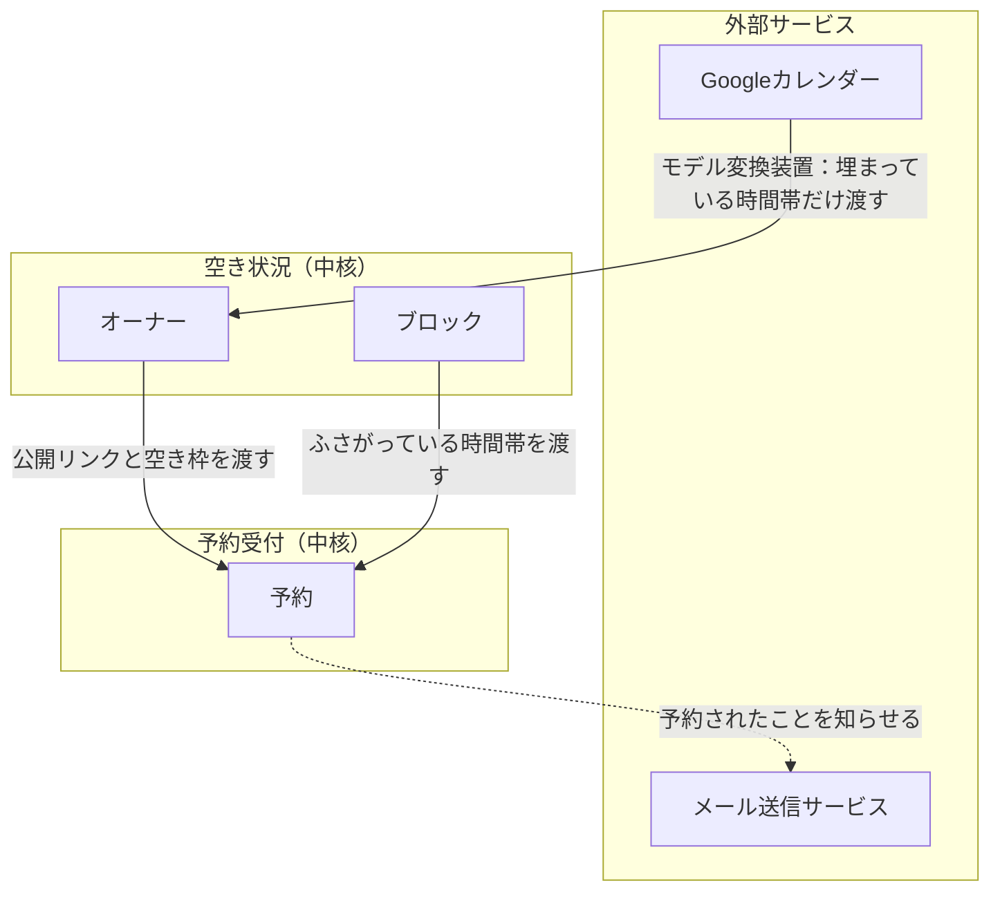

# コマドリ（KOMADORI）の設計の土台

カレンダーの所有者が公開リンクを渡すと、エージェントなどの相手がそのリンクで「予定あり」以外の空いているコマを選んで予定を入れられ、入った予定は所有者にメールで知らされるシステム。

## 1. 全体像

### 1.1 どんなオブジェクトができて、どうつながるか

矢印は上流から下流へ、材料が流れる向きに引いている。実線は材料を渡す流れ、点線は出来事を知らせる流れを表す。

外枠は区切られた文脈（Bounded Context）で、言葉の意味と決まりを一貫して扱う範囲を指す。中の箱は集約（Aggregate）のルートで、同時に守る決まりを持つ情報のまとまりを指す。
中心は「予約」。Googleの埋まり、自分で入れたブロック、他の予約の3つを重ねて空き枠を出し、相手が予約すると所有者にメールが届く。

### 1.2 中核の業務領域とそれ以外

| 業務領域 | 種類 | 一言の理由 | 方針 |
|---|---|---|---|
| 空き状況の公開 | 中核（仮） | 候補日をメールに書く手間をなくす、というアプリの存在理由そのもの | 自前で作り込む |
| 予約受付 | 中核（仮） | 相手がワンタップで押さえられる体験が差になる | 自前で作り込む |
| ログイン・Google連携 | 一般 | Google OAuth は既製の仕組みで足りる | 既製品（Auth.js） |
| メール通知 | 一般 | 送るだけなら外部サービスで足りる | 既製品（Resend など） |

### 1.3 必要な機能（抽象）

| 機能 | 中身の例 | どの文脈 | 作る／既製品／後回し |
|---|---|---|---|
| ログイン機能 | Googleでログインし、カレンダー参照の許可をもらう | 空き状況 | 既製品 |
| 空き枠表示機能 | 週表示で「空き」「予定あり」を出す。自分用と相手用の2画面 | 空き状況 | 作る |
| ブロック機能 | 自分でふさぎたい時間帯を登録・削除する | 空き状況 | 作る |
| 公開リンク機能 | 相手に渡すURLを発行する | 空き状況 | 作る |
| 仮押さえ機能 | コマを選んだ瞬間に数分間押さえ、他のゲストには「だれかが予約手続き中」と見せる | 予約受付 | 作る |
| 予約機能 | 仮押さえ中に名前と用件を入れて確定する | 予約受付 | 作る |
| 通知機能 | 予約が入ったら所有者のメールアドレスに送る | 予約受付 | 既製品 |
| コミック風デザイン | 影付きボタン、コマ割り風のカレンダー | 画面全体 | 作る |

## 2. 詳細（仮）

### 2.1 同じ言葉

| 言葉 | 意味A | 意味B | どう分けたか |
|---|---|---|---|
| 予定 | Googleカレンダーに入っている所有者の予定。中身を持つ | 相手が入れる予定。この画面で新しく作られる | Aは中身を捨てて「埋まり」と呼ぶ。Bは「予約」と呼ぶ |
| 予定あり | 所有者の画面ではブロックや予約の中身が見える | 相手の画面では理由を伏せて一律「予定あり」とだけ出る | 同じデータを画面ごとに見せ分ける。文脈は分けない |

| 用語 | 意味（日常語） |
|---|---|
| オーナー | カレンダーの所有者。リンクを発行し、通知を受け取る人 |
| ゲスト | リンクを受け取って予約する相手。エージェントなど。ログインしない |
| 埋まり | Googleカレンダー上で予定が入っている時間帯。中身は持たない |
| ブロック | オーナーが手で登録した、ふさぎたい時間帯 |
| 予約 | ゲストが空きコマに入れた予定 |
| コマ | 予約できる最小の時間の単位 |
| 仮押さえ | ゲストがコマを選んでから確定するまでの数分間、そのコマを押さえておくこと。期限が来たら自然に外れる |
| 空き枠 | 埋まり・ブロック・有効な仮押さえ・予約のどれにも重ならないコマ |
| 公開リンク | ゲストに渡すURL。オーナーごとに発行する |

### 2.2 必要な動作

| 種類 | 名前 | 誰が起こすか | 何が変わるか |
|---|---|---|---|
| 登場人物 | オーナー | | リンクを発行し、ブロックを入れ、通知を受ける |
| 登場人物 | ゲスト | | リンクを開き、空きコマに予約を入れる |
| 外部システム | Googleカレンダー | 入力側 | 指定した期間の埋まりを返す |
| 外部システム | メール送信サービス | 出力側 | オーナーにメールを届ける |
| コマンド | Googleでログインする | オーナー | オーナーが登録され、カレンダー参照の許可が保存される |
| コマンド | 公開リンクを発行する | オーナー | ゲスト用URLができる |
| コマンド | ブロックを登録する／削除する | オーナー | その時間帯が予定ありになる／空きに戻る |
| コマンド | 空き枠を見る | オーナー、ゲスト | 変化なし。埋まり・ブロック・予約を重ねて表示する |
| コマンド | コマを仮押さえする | ゲスト | 空き枠を確かめ直し、期限付きで押さえる。他の画面ではそのコマが「手続き中」になる |
| コマンド | 予約を確定する | ゲスト | 自分の仮押さえが期限内なら予約が確定する |
| コマンド | 仮押さえをやめる | ゲスト | 押さえが外れ、コマが空きに戻る |
| 業務イベント | 仮押さえされた | 予約受付 | そのコマが他のゲストから選べなくなる |
| 業務イベント | 仮押さえが期限切れになった | 時間の経過 | そのコマが空きに戻る。定期処理は置かず、期限を過ぎた押さえを数えないだけにする |
| 業務イベント | 予約された | 予約受付 | その時間帯が予定ありになる |
| ポリシー | 予約されたら、オーナーのメールアドレスに通知する | 予約受付 | メールが1通送られる |

### 2.3 区切られた文脈どうしのつながり方

| 利用者側 | 供給者側 | 連係パターン（日本語／原語） | 一言の理由 |
|---|---|---|---|
| 空き状況 | Googleカレンダー | モデル変換装置（Anticorruption Layer） | Googleの応答形式を、こちらの「埋まり（開始・終了の組）」に変換して使う |
| 予約受付 | 空き状況 | モデルの共有（Shared Kernel） | 空き枠の計算を両方が使う。同じアプリ内の1モジュールとして共有する |
| 予約受付 | メール送信サービス | 従属（Conformist） | 送信サービスの形式にそのまま合わせる |

2つの文脈は1つの Next.js アプリの中のフォルダとして置く。別サービスや別DBにはしない。

### 2.4 集約と守る決まり

| 集約（ルート） | 中に持つもの | 守る決まり | 起こす出来事 | 他集約への参照（ID） |
|---|---|---|---|---|
| オーナー | メールアドレス、Google連携の許可、公開リンクの識別子、受付の設定（仮） | 公開リンクの識別子は全オーナーで重複しない | なし | なし |
| ブロック | 開始、終了、メモ | 開始は終了より前 | なし | オーナーID |
| 予約 | 開始、終了、状態（仮押さえ中／確定）、押さえの期限、押さえた人の合言葉、ゲスト名、ゲスト連絡先、用件 | 仮押さえの時点で、埋まり・ブロック・有効な仮押さえ・確定済みの予約のどれにも重ならない。確定できるのは、期限内の仮押さえを押さえた本人だけ | 仮押さえされた、予約された | オーナーID |

重なりの判定は「確定ボタン」ではなく「コマを選んだ瞬間（仮押さえ）」で行う。ゲストが入力している数分間が、業務上のトランザクションになる。
仮押さえは予約と同じ行に「仮押さえ中」の状態と期限を持たせて表す。別の集約にしないのは、仮押さえと確定が同じ「重ならない」の決まりを守るから。
2人が同じ瞬間にコマを押した場合に備え、仮押さえの保存時は同じトランザクションでオーナーの版番号を確かめて上げる。これでオーナー単位で仮押さえを1件ずつに並べる（仮）。後から来た方には「タッチの差で取られた！」と返す。
押さえた人の合言葉はランダムな値で、ゲストのブラウザだけが持つ。確定とやめる操作ではこれを照合し、他人が確定できないようにする。

画面での見せ方。
- 押さえた本人：入力欄の上に残り時間のカウントダウンを出す。残り1分で色を変えて急かす。
- 他のゲスト：そのコマを斜線とハンコ風の「手続き中！」で塗り、押せなくする。画面は数秒おきと、タブに戻ったときに取り直す。
- 期限切れ：本人の画面を「時間切れ！もう一度選んでね」に切り替え、コマは自動で空きに戻る。

### 2.5 テーブルの当たり（仮）

| テーブル | 主キー | 最低限の列 | 最低限考慮すること |
|---|---|---|---|
| owners | id | email、公開リンク識別子、版番号 | 公開リンク識別子に一意制約。Googleの許可情報は Auth.js のアカウントテーブルに持つ |
| blocks | id | owner_id、開始、終了、メモ | 時刻はUTCで保存し、表示はAsia/Tokyo。削除は物理削除でよい（仮） |
| bookings | id | owner_id、開始、終了、状態、押さえの期限、合言葉のハッシュ、ゲスト名、ゲスト連絡先、用件 | 期限切れの仮押さえは消さずに無視する。溜まったら確定や表示のついでに消す（仮）。取り消しを入れるなら状態で論理削除（仮）。時刻はUTC |

Googleの埋まりは保存しない。表示と確定のたびに取り直す。
コマの長さ、表示する期間、何時間先から予約できるか、仮押さえの長さ（既定5分）、画面を取り直す間隔などの数値は、設定ファイルに名前を付けて置く。

### 2.6 実装方式

| 文脈 | 実装方式 | 一言の理由 |
|---|---|---|
| 空き状況 | トランザクションスクリプト | 取る、重ねる、返すの手順で足りる。読み書きは Prisma を通す |
| 予約受付 | トランザクションスクリプト | 決まりは「重ならない」と「本人だけが確定できる」の2つ。仮押さえと確定の処理の中で確かめて保存する |

技術方式は Next.js（App Router）＋ Prisma ＋ Postgres（Neon）＋ Auth.js ＋ Resend で、Vercel だけで動く（仮）。仮押さえの期限切れは「期限を過ぎたものを数えない」で済ませ、常駐処理も定期実行も置かない。他の画面への反映は数秒おきの取り直しで行い、WebSocket は使わない。このため Railway は今のところ不要。
フォルダは `features/availability`、`features/booking`、`lib/google`、`lib/mail` 程度に分け、層を増やさない。

### 2.7 デザインパターン

| パターン | 当てる場所 | 要件文の言い回し | 迷った隣と選ばなかった理由 | 出典（URL 全文） |
|---|---|---|---|---|
| State | 予約の状態（仮押さえ中／確定／期限切れ） | 「確定し始めて確定するまでの間は…いれられなくする」。状態によって確定ボタンの可否と画面の見せ方が変わる | 状態が3つなので専用クラスは作らず、判別可能な共用体と switch で書く | https://www.techscore.com/tech/DesignPattern/State.html |
| Adapter | Googleの応答を「埋まり」の配列に変換する関数 | 「googleカレンダーから予定を取り出してその予定が入ってる時間は予定あり」 | Facade。外部は用途ごとに1つずつで、呼ぶ順番の縛りもないので基準を満たさない | https://www.techscore.com/tech/DesignPattern/Adapter/Adapter1.html |

通知は受け手が1つなので Observer にせず、予約確定の処理の最後でメール送信関数を呼ぶ。

## 3. 決めてもらうこと

1. 予約が入ったら、オーナーのGoogleカレンダーにも予定を書き込むか。書き込むならGoogleへの許可を「埋まりだけ読む」から「予定の作成」に広げる。これで許可の範囲と、予約受付からGoogleへの矢印が確定する
2. 予約の長さは、オーナーが決めた長さ（例：60分）から選ぶ形か、ゲストが開始と終了を自由に選ぶ形か。これでコマの扱いと重なり判定の方法が確定する
3. 予約を受け付ける時間帯（例：平日10〜19時）を設定するか、埋まっていない時間は24時間すべて空きとするか。これでオーナーの「受付の設定」の中身が確定する
4. 公開リンクはオーナーに1本か、相手ごとに発行するか（例：JAC用、別エージェント用）。相手ごとなら「公開リンク」を独立した集約に分ける
5. ゲストにも確認メールを送るか。送るならゲストのメールアドレスを必須にし、通知先が2つになる
6. 予約の取り消しや変更は最初から要るか。要るなら予約に状態と取り消し用のURLを持たせる
7. 使うのは自分だけか、他の人もログインしてオーナーになれるか。他の人も使うならGoogleのアプリ審査が必要になり、公開の手順が変わる
8. 埋まりとして見るのはメインのカレンダーだけか、複数のカレンダーか。複数ならオーナーに「見るカレンダーの一覧」を持たせる
